# 💡 Guía de Proyecto: Control de Tira LED RGB Direccionable (WS2811 12V) - Versión Simplificada

Este documento detalla la planificación, componentes y el conexionado necesario para configurar una tira LED RGB direccionable simplificando el hardware al prescindir de potenciómetros y pulsadores físicos. El control de encendido, apagado, color e intensidad se gestiona directamente desde el microcontrolador mediante código a medida (programación) y el control físico de encendido general se reduce a un interruptor clásico insertado en el cable de alimentación.

---

## 📋 Lista de Componentes

### De tu Inventario

* **Microcontrolador**: `Módulo ESP32 / ESP8266 (NodeMCU / DevKit)` (Modelo específico seleccionado: **NodeMCU ESP8266 4MB ESP-12E WiFi PWM I2C** [Foto de origen: IMG_5031.jpeg](file:///Users/ivanbudnick/Documents/Inventario/fotos/IMG_5031.jpeg)). Encargado del control lógico y la conectividad inalámbrica del proyecto.
* **Tira LED**: `Tira de LED RGB Digital` (2.5 metros con 75 LEDs, protocolo WS2811). Cuenta con sus 3 cables pre-soldados en el extremo.
* **Fuente de Alimentación**: `Fuente de alimentación / Adaptador AC/DC (Sagemcom)` (Salida: 12V 2.0A). Soporta perfectamente la corriente requerida por la tira.
* **Conector de Corriente**: `Conector Jack DC hembra para chasis (DC-022)` (para recibir la ficha de la fuente de 12V sin cortarla).
* **Módulo Regulador Step-Down (Buck Converter)**: `Módulo Regulador Step-Down DC-DC LM2596 (HW-411)`. Reduce los 12V de la fuente principal a 5V para alimentar el microcontrolador por su pin `VIN` / `5V`.
* **Condensador Electrolítico**: `Capacitor Electrolítico 2200 µF / 16V`. Se conecta en paralelo a las líneas de alimentación de la tira LED para absorber picos de corriente. *(Nota: El voltaje de 16V tiene menor margen de seguridad sobre los 12V de alimentación que un capacitor de 25V, por lo que es crítico respetar estrictamente la polaridad en la conexión).*
* **Conversor de Nivel Lógico (Level Shifter)**: `Conversor de Nivel Lógico / Buffer Cuádruple 74HCT125 (GD74HCT125)` ([Foto de origen: IMG_5092.jpg](file:///Users/ivanbudnick/Documents/Inventario/fotos/IMG_5092.jpg)). Adaptador de nivel lógico DIP-14 para elevar la señal de datos de 3.3V del microcontrolador a los 5V que requiere la tira LED WS2811, previniendo parpadeos e inestabilidad en la transmisión.
* **Componentes Pasivos**:
  * `Resistencia de 470 Ω` o `220 Ω` (de tu pack de resistencias surtidas, para la línea de datos DIN).
* **Montaje y Pruebas**:
  * `Protoboard MB-102` y `Cables Jumper DuPont` (macho-macho / macho-hembra).
  * `Cables unipolares de 0.25mm` para el armado definitivo.
  * `Soldador tipo lápiz` Zurich, `Estaño` y `Tubo termocontraíble` para aislar las uniones soldadas.
  * `Interruptor de paso clásico` (Interruptor de velador, de color negro).
  * **Herramientas**: `Multímetro Digital Uni-T UT33A+` (auto-rango con medición de capacitancia, continuidad y corrientes de hasta 10A).

### Sugeridos para Adquirir

*Actualmente no hay componentes pendientes por adquirir; todos los componentes recomendados ya forman parte de tu inventario.

---

## 🔌 Esquema del Conexionado

### 💡 Justificación y Función de los Componentes en el Circuito
Para armar correctamente el circuito, es fundamental entender para qué sirve cada parte en las conexiones eléctricas:
* **Fuente de Alimentación (12V 2.0A)**: Suministra la energía principal. La tira LED funciona a 12V y puede consumir corrientes de hasta ~1.8A.
* **Conector Jack DC Hembra (DC-022)**: Funciona como el puerto físico de entrada de la corriente para no tener que cortar la ficha original de la fuente.
* **Interruptor de Paso**: Permite el corte físico de la alimentación del circuito. Puede ir en los 220V o en la línea de 12V.
* **Capacitor Electrolítico (2200 µF / 16V)**: Actúa como un reservorio rápido de energía en la línea de 12V para amortiguar las caídas de tensión bruscas causadas por los rápidos cambios de brillo/color en los LEDs. *Nota de seguridad: al estar cerca del límite de 16V, respeta estrictamente su polaridad (+ y -) para evitar fallas.*
* **Módulo Regulador Step-Down DC-DC LM2596 (HW-411)**: Reduce de manera eficiente los 12V principales a 5V estables. Es necesario porque el microcontrolador y el conversor lógico no toleran 12V y se dañarían.
* **NodeMCU ESP8266**: El cerebro del proyecto. Controla la lógica de colores, brillo y efectos, y ofrece conectividad WiFi.
* **Conversor de Nivel Lógico (GD74HCT125)**: Eleva la señal de datos digital de 3.3V (salida del NodeMCU) a los 5V (nivel lógico TTL) que requiere la tira WS2811. Esto previene destellos aleatorios ("flicker") o pérdidas de señal.
* **Resistencia de 470 Ω o 220 Ω**: Ubicada en serie en la línea de datos (`DIN`) justo antes del primer LED. Protege la entrada lógica de picos de voltaje y atenúa rebotes de señal en el cable.
* **Tira de LED RGB Digital (WS2811 12V)**: El elemento de iluminación final que interpreta y muestra las señales recibidas.

### 🗺️ Diagrama de Conexiones (Esquema del Circuito)
A continuación se detalla cómo deben realizarse las conexiones físicas. Un punto sumamente crítico es tener una **Masa (GND) Común** para unificar el circuito de control (5V) con el de potencia (12V):

```mermaid
graph TD
    %% Estilos de bloques
    classDef pwr fill:#ffe6cc,stroke:#d79b00,stroke-width:2px,color:#000;
    classDef ctrl fill:#dae8fc,stroke:#6c8ebf,stroke-width:2px,color:#000;
    classDef led fill:#d5e8d4,stroke:#82b366,stroke-width:2px,color:#000;
    classDef pass fill:#f5f5f5,stroke:#666666,stroke-width:1px,color:#000;

    %% Nodos principales
    subgraph Entrada ["Alimentación Principal"]
        Jack[Jack DC Hembra DC-022]
        Switch[Interruptor de Paso]
    end

    subgraph Regulador ["Conversión de Voltaje"]
        StepDown[Regulador Step-Down LM2596]
    end

    subgraph Cerebro ["Controlador"]
        NodeMCU[NodeMCU ESP8266]
    end

    subgraph Adaptador ["Adaptador de Señal"]
        Shifter[GD74HCT125 Level Shifter]
    end

    subgraph Salida ["Iluminación y Protección"]
        Cap[Capacitor 2200uF 16V]
        Res[Resistencia 470 Ohm]
        TiraLED[Tira LED WS2811 12V]
    end

    %% Conexiones de Alimentación 12V
    Jack -- "+12V" --> Switch
    Switch -- "+12V" --> Cap_Pos["+ (Pata larga)"]
    Cap_Pos --> TiraLED_12V[Cable Rojo +12V]
    Switch -- "+12V" --> StepDown_IN_Pos[IN+]
    
    Jack -- "GND" --> GND_Bus["Riel GND Común (Protoboard)"]
    GND_Bus --> Cap_Neg["- (Pata corta)"]
    Cap_Neg --> TiraLED_GND[Cable Negro GND]
    GND_Bus --> StepDown_IN_Neg[IN-]
    
    %% Conexiones 5V (Salida StepDown)
    StepDown_OUT_Pos[OUT+ 5V] --> Riel_5V["Riel +5V (Protoboard)"]
    StepDown_OUT_Neg[OUT- GND] --> GND_Bus
    
    Riel_5V --> NodeMCU_VIN[VIN / 5V]
    Riel_5V --> Shifter_VCC[Pin 14 VCC]
    GND_Bus --> NodeMCU_GND[GND]
    GND_Bus --> Shifter_GND[Pin 7 GND]
    GND_Bus --> Shifter_1OE[Pin 1 1OE]

    %% Conexiones de Señal de Datos
    NodeMCU -- "GPIO 2 (Pin D4)" --> Shifter_1A[Pin 2 1A]
    Shifter_1Y[Pin 3 1Y] -- "Datos 5V" --> Res
    Res -- "Datos Protegidos" --> TiraLED_DIN[Cable Verde/Amarillo DIN]

    %% Pines de control sobrantes a GND (Buenas prácticas en el chip 74HCT125)
    GND_Bus -. "Silenciar pines no usados" .-> Shifter_Pines[Pines 4, 5, 9, 10, 12, 13]

    %% Asignar Clases
    class Jack,Switch,StepDown,Cap pwr;
    class NodeMCU ctrl;
    class Shifter,Res pass;
    class TiraLED led;
```



### 📋 Identificación de Cables de la Tira LED:
* **Cable Rojo**: Entrada de Alimentación Positiva (`+12V`).
* **Cable Negro** (o Blanco): Masa/Retorno (`GND`).
* **Cable Central** (Verde o Amarillo): Línea de datos direccionable (`DIN` / `Data`).

### 🛠️ Pasos para el Armado Físico (Paso a Paso):

1. **Preparación de Alimentación e Interruptor**:
   * **Opción con interruptor en 12V**: 
     * Soldar un cable al pin negativo (`GND`) del **Jack DC Hembra (DC-022)** y llevarlo a la **línea de GND común** de la protoboard.
     * Soldar un cable al pin positivo (`+12V`) del Jack DC, conectarlo a un extremo del **interruptor de paso**, y desde el otro extremo llevarlo hacia la **línea roja (+12V)** de la protoboard.
   * **Opción con interruptor en 220V (Recomendada)**:
     * Instalar el interruptor de velador interrumpiendo una de las fases del cable de red (220V) antes de la fuente de alimentación.
     * Soldar directamente los terminales positivo y negativo del Jack DC Hembra a las líneas de alimentación (`+12V` y `GND`) de la protoboard.

2. **Conexión de la Tira LED**:
   * Conectar el **cable positivo (+12V)** de la tira (Rojo) al riel de **+12V** de la protoboard.
   * Conectar el **cable de masa (GND)** de la tira (Negro) al riel de **GND** de la protoboard.
   * Conectar el **cable de datos central (DIN)** de la tira (Verde/Amarillo) a una columna vacía y aislada de la protoboard.
   * Colocar el **Capacitor de 2200 µF** con su pata positiva en la línea de +12V y su pata negativa en la línea de GND, lo más cerca posible de los cables de alimentación de la tira LED.

3. **Conexión del Microcontrolador (NodeMCU ESP8266)**:
   * Insertar el NodeMCU ESP8266 en la protoboard.
   * Conectar un pin **GND** del microcontrolador al riel de **GND** de la protoboard.
   * *Alimentación definitiva:* Conectar la salida regulada de 5V del Step-Down (OUT+) al pin **VIN** (o **5V**) y la masa (OUT-) al riel de **GND** común.

4. **Línea de Datos y Conversor de Nivel Lógico (74HCT125)**:
   * Insertar el integrado 74HCT125 en la protoboard (cruzando el canal central de aislamiento).
   * Conectar el **Pin 14 (VCC)** al riel de **+5V** (salida del Step-Down).
   * Conectar el **Pin 7 (GND)** al riel de **GND** común de la protoboard.
   * Conectar el **Pin 1 (1OE - Output Enable)** a **GND** (para habilitar el buffer número 1).
   * Conectar el **Pin 2 (1A - Entrada del Buffer 1)** al pin digital **D4 (GPIO 2)** del NodeMCU.
   * Conectar el **Pin 3 (1Y - Salida del Buffer 1)** a un extremo de la **resistencia de 470 Ω** (o 220 Ω).
   * Conectar el otro extremo de la resistencia a la columna de la protoboard donde se conectó el **cable de datos central (DIN)** de la tira LED.
   * *(Recomendación para evitar ruido):* Conectar los pines de entrada y habilitación no utilizados (pines 4, 5, 9, 10, 12 y 13) a la línea de **GND**.

---

## 🛠️ Control y Programación mediante Código

Al prescindir de controles físicos como potenciómetros o pulsadores, toda la lógica de encendido, apagado, regulación de brillo y selección de colores se realiza directamente en el código del microcontrolador.

Para esto, se recomienda utilizar la biblioteca **FastLED** (una de las más eficientes y populares para el control de LEDs direccionables en Arduino/ESP32).

### Código de Ejemplo (Arduino / ESP32)

El siguiente ejemplo demuestra cómo estructurar funciones en tu código para controlar:
1. **Encendido y Apagado (On/Off)** de forma lógica.
2. **Brillo (Intensidad)**.
3. **Color** de la tira completa.

```cpp
#include <FastLED.h>

#define NUM_LEDS 75
#define DATA_PIN 2 // GPIO 2 en ESP32 o D4 en ESP8266

CRGB leds[NUM_LEDS];

// Variables de estado de la tira
bool tiraEncendida = true;
uint8_t brilloActual = 128; // Rango de 0 (apagado) a 255 (brillo máximo)
CRGB colorActual = CRGB(255, 147, 41); // Color inicial (Blanco Cálido)

// Declaración de funciones de control
void actualizarTira();
void encenderTira();
void apagarTira();
void establecerBrillo(uint8_t nuevoBrillo);
void establecerColor(CRGB nuevoColor);

void setup() {
  // Inicialización de la tira LED (protocolo WS2811, orden de color GRB)
  FastLED.addLeds<WS2811, DATA_PIN, GRB>(leds, NUM_LEDS);
  
  // Aplicamos el estado inicial
  actualizarTira();
}

void loop() {
  // Aquí puedes programar tu lógica temporal, temporizadores, 
  // secuencias de efectos, o integrar comunicación (Serial, Bluetooth, etc.)
  
  // Ejemplo de simulación:
  // 1. Después de un tiempo, cambiar el color a Azul
  delay(5000);
  establecerColor(CRGB(0, 0, 255));
  
  // 2. Bajar la intensidad (brillo) a la mitad
  delay(5000);
  establecerBrillo(64);
  
  // 3. Apagar la tira
  delay(5000);
  apagarTira();
  
  // 4. Volver a encender en Blanco Cálido y brillo original
  delay(5000);
  establecerColor(CRGB(255, 147, 41));
  establecerBrillo(128);
  encenderTira();
}

// --- Funciones de Control ---

// Aplica el color y el brillo en base al estado de encendido
void actualizarTira() {
  if (tiraEncendida) {
    FastLED.setBrightness(brilloActual);
    fill_solid(leds, NUM_LEDS, colorActual);
  } else {
    // Si está apagada lógicamente, ponemos el brillo en 0 y limpiamos los leds
    FastLED.setBrightness(0);
    fill_solid(leds, NUM_LEDS, CRGB::Black);
  }
  FastLED.show();
}

// Enciende la tira (restaurando el último color y brillo configurados)
void encenderTira() {
  tiraEncendida = true;
  actualizarTira();
}

// Apaga la tira de forma lógica (sin cortar la alimentación del ESP32)
void apagarTira() {
  tiraEncendida = false;
  actualizarTira();
}

// Cambia el brillo de la tira
void establecerBrillo(uint8_t nuevoBrillo) {
  brilloActual = nuevoBrillo;
  actualizarTira();
}

// Cambia el color de la tira
void establecerColor(CRGB nuevoColor) {
  colorActual = nuevoColor;
  actualizarTira();
}
```
